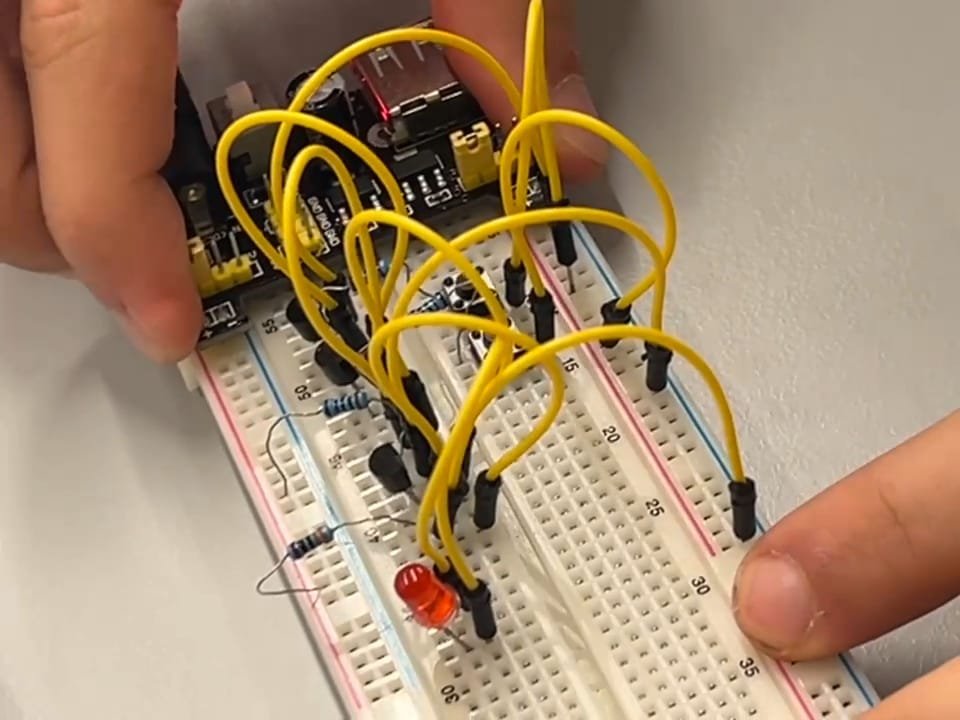

kodlari yenilemeliyem yene?

Bəli, Nargiz, sonuncu dəfə kodu yeniləməlisiniz!

Bu dəyişiklik çox kiçikdir, lakin vacibdir. Sizin yaratdığınız Repozitoriyanın dəqiq linkini bütün 3 səhifənizin (index.html, about.html, projects.html) ayaq bölməsinə (Footer) daxil etməliyik.

Bu, bütün HTML kodlarınızın tam və yekun versiyası olacaq.

Zəhmət olmasa, hər üç HTML faylınızın daxilindəki `` hissəsini tapın və aşağıdakı yeni kodla əvəz edin:

1. Düzəliş Ediləcək Yekun Footer Kodu 🔗
Bu kod, sizin index.html, about.html, və projects.html fayllarınızın hər birində ƏN ALTDA yerləşən <footer> hissəsini əvəz etməlidir.

HTML
    <footer class="main-footer">
        

            <h4>Contact</h4>
            
Email: nmansurova@ada.edu.az

            
Location: Baku

        

        

            <h4>Socials (Icons Required!)</h4>
            <a href="https://github.com/mansurovanergiz2008-debug" target="_blank">Github Profile</a> 
            <a href="https://www.codecademy.com/profiles/object2354502277" target="_blank">Codecademy Profile</a>
        

        

            <h4>Site Links</h4>
            <a href="index.html">Home</a>
            <a href="about.html">About</a>
            <a href="projects.html">Projects</a>
        

        

            <h4>Repository</h4>
            <a href="https://github.com/mansurovanergiz2008-debug/my-personal-website" target="_blank">View Site Repository</a>
        

    </footer>
</body>
</html>
2. Son Kommit və Yükləmə (Push) 🚀
Bütün 3 HTML faylını bu yeni kodla yenilədiyinizdən və yadda saxladığınızdan əmin olun.

İndi Terminalda son və yekun komandaları işə salın:

Addım 1: Dəyişiklikləri Kommit Edin
Bu, Repozitoriya linklərini düzəltdiyinizi təsdiqləyən son kommitdir.

Bash
git add .
git commit -m "Final link update: Added correct public GitHub Repository URL to all footers"
Addım 2: Hər Şeyi GitHub-a Yükləyin (PUSH!)
Bu komanda bütün işlərinizi, bütün fayllarınızı və kommitlərinizi GitHub-a göndərir.

Bash
git push origin main
Uğurlar! Sizin saytınız indi tam hazırdır və təqdimat üçün bütün tələblər yerinə yetirilmişdir.

kodlari yenile butov at da son versiyani

Bəli, Nargiz! Sizin bütün son istəklərinizlə (linklər, JPEG, şəklin yer tutucusu) daxil edilmiş dörd faylın hamısının son, tam və yekun versiyaları aşağıdadır.

Zəhmət olmasa, hər bir kod blokunu uyğun faylınızdakı bütün mövcud məzmunla əvəz edin.

1. Yekun index.html (Ana Səhifə)
HTML
<!DOCTYPE html>
<html lang="en">
<head>
    <meta charset="UTF-8">
    <meta name="viewport" content="width=device-width, initial-scale=1.0">
    <title>Nargiz Mansurova - Portfolio</title>
    <link rel="stylesheet" href="css/style.css"> 
</head>
<body>

    <header class="main-header">
        
Nargiz Mansurova

        <nav class="main-nav">
            <a href="index.html" class="active">Home</a>
            <a href="about.html">About</a>
            <a href="projects.html">Projects</a>
        </nav>
    </header>

    <main class="content-wrapper">
        <section class="hero-section">
            

                <h1>Hi, I'm **Nargiz Mansurova**, a student developer based in Baku.</h1>
                
I am interested in web development and currently studying **BS in Mathematics**. I use GenAI to help me build clean and responsive web projects.

                <a href="projects.html" class="cta-button">View My Projects</a>
            

            

                

                    <h2>Profile Photo Placeholder</h2>
                    
(Student photo intentionally excluded)

                

            

        </section>
    </main>

    <footer class="main-footer">
        

            <h4>Contact</h4>
            
Email: nmansurova@ada.edu.az

            
Location: Baku

        

        

            <h4>Socials (Icons Required!)</h4>
            <a href="https://github.com/mansurovanergiz2008-debug" target="_blank">Github Profile</a> 
            <a href="https://www.codecademy.com/profiles/object2354502277" target="_blank">Codecademy Profile</a>
        

        

            <h4>Site Links</h4>
            <a href="index.html">Home</a>
            <a href="about.html">About</a>
            <a href="projects.html">Projects</a>
        

        

            <h4>Repository</h4>
            <a href="https://github.com/mansurovanergiz2008-debug/my-personal-website" target="_blank">View Site Repository</a>
        

    </footer>

</body>
</html>
2. Yekun about.html (Haqqımızda Səhifəsi)
HTML
<!DOCTYPE html>
<html lang="en">
<head>
    <meta charset="UTF-8">
    <meta name="viewport" content="width=device-width, initial-scale=1.0">
    <title>Nargiz Mansurova - About</title>
    <link rel="stylesheet" href="css/style.css"> 
</head>
<body>

    <header class="main-header">
        
Nargiz Mansurova

        <nav class="main-nav">
            <a href="index.html">Home</a>
            <a href="about.html" class="active">About</a>
            <a href="projects.html">Projects</a>
        </nav>
    </header>

    <main class="content-wrapper">
        <section class="page-content">
            <h1>About Nargiz Mansurova</h1>
            
Welcome to my portfolio! I am a student developer based in Baku, currently dedicated to learning and applying modern web development principles. This portfolio is my first major project, completed for the SITE 1101 course.

            <h2>Academic Background</h2>
            
I am a student pursuing a **Bachelor of Science (BS) in Mathematics**. My studies have provided me with strong analytical skills and a logical approach to problem-solving, which I now apply to web development.

            <h2>Key Activities and Qualifications</h2>
            <ul>
                <li>**Web Development:** Gained proficiency in creating responsive, multi-page static websites using HTML and CSS.</li>
                <li>**Version Control:** Learned and applied core Git commands (`status`, `add`, `commit`, `push`) and utilized the GitHub platform for project management.</li>
                <li>**GenAI Integration:** Used Generative AI tools to assist and streamline the development process, focusing on clean and modular code structures.</li>
            </ul>

            
I am eager to expand my skills into JavaScript and dynamic web applications as I continue my educational journey.

        </section>
    </main>

    <footer class="main-footer">
        

            <h4>Contact</h4>
            
Email: nmansurova@ada.edu.az

            
Location: Baku

        

        

            <h4>Socials (Icons Required!)</h4>
            <a href="https://github.com/mansurovanergiz2008-debug" target="_blank">Github Profile</a> 
            <a href="https://www.codecademy.com/profiles/object2354502277" target="_blank">Codecademy Profile</a>
        

        

            <h4>Site Links</h4>
            <a href="index.html">Home</a>
            <a href="about.html" class="active">About</a>
            <a href="projects.html">Projects</a>
        

        

            <h4>Repository</h4>
            <a href="https://github.com/mansurovanergiz2008-debug/my-personal-website" target="_blank">View Site Repository</a>
        

    </footer>

</body>
</html>
3. Yekun projects.html (Layihələr Səhifəsi)
HTML
<!DOCTYPE html>
<html lang="en">
<head>
    <meta charset="UTF-8">
    <meta name="viewport" content="width=device-width, initial-scale=1.0">
    <title>Nargiz Mansurova - Projects</title>
    <link rel="stylesheet" href="css/style.css"> 
</head>
<body>

    <header class="main-header">
        
Nargiz Mansurova

        <nav class="main-nav">
            <a href="index.html">Home</a>
            <a href="about.html">About</a>
            <a href="projects.html" class="active">Projects</a>
        </nav>
    </header>

    <main class="content-wrapper">
        <h1>My Projects</h1>
        <section class="projects-grid">
            
            

                <h2>Project 1: Basic Logic Gates (SITE 1101)</h2>
                
                

                    This project focused on the **physical construction and testing of basic logic gates (OR gate)** using breadboards, LEDs, and electronic components. It helped solidify my understanding of fundamental digital logic principles required for information systems.
                

                <a href="http://www.youtube.com/watch?v=x_BJixN9u9A" target="_blank" class="cta-button">View Documentation / Code</a>
            

            </section>
    </main>

    <footer class="main-footer">
        

            <h4>Contact</h4>
            
Email: nmansurova@ada.edu.az

            
Location: Baku

        

        

            <h4>Socials (Icons Required!)</h4>
            <a href="https://github.com/mansurovanergiz2008-debug" target="_blank">Github Profile</a> 
            <a href="https://www.codecademy.com/profiles/object2354502277" target="_blank">Codecademy Profile</a>
        

        

            <h4>Site Links</h4>
            <a href="index.html">Home</a>
            <a href="about.html">About</a>
            <a href="projects.html">Projects</a>
        

        

            <h4>Repository</h4>
            <a href="https://github.com/mansurovanergiz2008-debug/my-personal-website" target="_blank">View Site Repository</a>
        

    </footer>

</body>
</html>
4. Yekun css/style.css Kodu (Tam Versiya)
CSS
:root {
    --primary-color: #004c99; /* ADA University Blue */
    --secondary-color: #f7f7f7; /* Light background */
    --accent-color: #ff9900; /* Orange/Gold accent */
    --text-color: #333;
    --font-family: sans-serif;
}

/* === BASE STYLES === */
body {
    font-family: var(--font-family);
    line-height: 1.6;
    margin: 0;
    padding: 0;
    color: var(--text-color);
    background-color: #fff;
}

.content-wrapper {
    max-width: 1200px;
    margin: 0 auto;
    padding: 20px;
    min-height: 60vh; /* Ekranın böyük hissəsini doldurur */
}

a {
    color: var(--primary-color);
    text-decoration: none;
    transition: color 0.3s;
}

a:hover {
    color: var(--accent-color);
}

.cta-button {
    display: inline-block;
    background-color: var(--accent-color);
    color: white;
    padding: 10px 20px;
    border-radius: 5px;
    margin-top: 15px;
    text-transform: uppercase;
    font-weight: bold;
}

.cta-button:hover {
    background-color: #cc7a00;
    color: white;
}

/* === HEADER & NAVIGATION === */
.main-header {
    background-color: var(--primary-color);
    color: white;
    padding: 15px 0;
    box-shadow: 0 2px 5px rgba(0, 0, 0, 0.1);
}

.main-header > * {
    max-width: 1200px;
    margin: 0 auto;
    padding: 0 20px;
    display: flex;
    justify-content: space-between;
    align-items: center;
}

.logo {
    font-size: 1.5em;
    font-weight: bold;
}

.main-nav a {
    color: white;
    margin-left: 20px;
    padding: 5px 10px;
    border-radius: 5px;
}

.main-nav a.active {
    background-color: var(--accent-color);
}

.main-nav a:hover {
    background-color: rgba(255, 255, 255, 0.2);
    color: white;
}

/* === HOME PAGE HERO SECTION (Split Screen) === */
.hero-section {
    display: flex;
    align-items: center;
    padding: 60px 0;
    background-color: var(--secondary-color);
    border-radius: 8px;
    margin-top: 20px;
}

.hero-text {
    flex: 2; /* İki hissədən böyük (66%) */
    padding-right: 40px;
}

.hero-text h1 {
    font-size: 2.5em;
    margin-top: 0;
}

.hero-image {
    flex: 1; /* Bir hissə (33%) */
    min-height: 300px;
    display: flex;
    align-items: center;
    justify-content: center;
}

/* Şəxsi şəkil yerinə yer tutucu stilizasiyası */
.hero-image .image-placeholder {
    width: 100%;
    height: 100%;
    display: flex;
    flex-direction: column;
    justify-content: center;
    align-items: center;
    background-color: #e0e0e0; 
    border: 3px dashed #aaa;
    border-radius: 8px;
    color: #555;
    text-align: center;
    padding: 20px;
}

.hero-image .image-placeholder h2 {
    margin-bottom: 5px;
    font-size: 1.2em;
}
.hero-image .image-placeholder p {
    font-size: 0.8em;
}

/* === ABOUT & PROJECT PAGE CONTENT STYLES === */
.page-content {
    padding: 40px 0;
}

.page-content h1 {
    color: var(--primary-color);
    border-bottom: 2px solid var(--accent-color);
    padding-bottom: 10px;
    margin-bottom: 20px;
}

.page-content h2 {
    color: var(--primary-color);
    margin-top: 30px;
}

.page-content ul {
    list-style: disc;
    padding-left: 20px;
}

/* === PROJECTS PAGE GRID STYLING === */
.projects-grid {
    display: grid;
    /* 300px minimum enində avtomatik sütunlar yaradır */
    grid-template-columns: repeat(auto-fit, minmax(300px, 1fr)); 
    gap: 30px;
    padding: 20px 0;
}

.project-card {
    background-color: #ffffff;
    border: 1px solid #ddd;
    border-radius: 8px;
    padding: 20px;
    box-shadow: 0 2px 5px rgba(0, 0, 0, 0.05);
}

.project-card h2 {
    color: var(--accent-color);
    margin-top: 0;
    margin-bottom: 15px;
}

.project-card img {
    width: 100%;
    height: auto;
    border-radius: 4px;
    margin-bottom: 15px;
    border: 1px solid #ccc;
}

/* === FOOTER STYLES === */
.main-footer {
    background-color: var(--primary-color);
    color: white;
    padding: 40px 20px;
    margin-top: 40px;
    display: flex;
    justify-content: space-between;
    flex-wrap: wrap; /* Kiçik ekranlarda alt-alta düşür */
}

.footer-col {
    width: 23%; 
    min-width: 150px;
    margin-bottom: 20px;
}

.footer-col h4 {
    border-bottom: 2px solid var(--accent-color);
    padding-bottom: 10px;
    margin-bottom: 15px;
    font-size: 1.1em;
}

.footer-col a, .footer-col p {
    display: block;
    color: #e0e0e0;
    margin-bottom: 5px;
    font-size: 0.9em;
}

.main-footer a:hover {
    color: var(--accent-color);
}

/* === RESPONSIVE DESIGN (Telefonlar üçün) === */
@media (max-width: 768px) {
    .main-header > * {
        flex-direction: column;
        align-items: flex-start;
    }

    .main-nav {
        margin-top: 10px;
    }

    .main-nav a {
        margin-left: 0;
        margin-right: 10px;
        display: inline-block;
    }

    .hero-section {
        flex-direction: column;
        padding: 30px 0;
    }

    .hero-text {
        padding-right: 0;
        margin-bottom: 30px;
    }
    
    .hero-text h1 {
        font-size: 2em;
    }

    .hero-image {
        min-height: 250px;
        width: 100%;
    }

    .main-footer {
        flex-direction: column;
    }

    .footer-col {
        width: 100%;
    }
}
Son Təsdiq və Komandalar 💾
Bütün bu kodu düzgün fayllara yerləşdirdiyinizdən və yadda saxladığınızdan əmin olduqdan sonra, Terminalda bu yekun komandaları işə salın:

Bash
git add .
git commit -m "Final link update and code synchronization before final push"
git push origin main
Bu, həm kodunuzun linklərini düzəldəcək, həm də bütün işlərinizi Repozitoriyanıza göndərəcək. Siz uğurla tamamladınız!

aha sonra

Sizin üçün ən son və ən vacib addım GitHub-a yükləmə (Push) və təqdimatın tamamlanmasıdır!

Artıq kodlarınız tam hazırdır. Bu, sizin etməli olduğunuz yekun 3 addımdır:

1. Yekun Faylların Yadda Saxlanması 💾
Əmin olun ki, index.html, about.html, projects.html və css/style.css fayllarınızın hamısı yadda saxlanılıb (Ctrl+S və ya Cmd+S).

2. Terminalda Son Komandalar 🚀
VS Code-dakı Terminalı açın və bütün işlərinizi Repozitoriyanıza göndərmək üçün bu komandaları ardıcıl işlədin:

A. Dəyişiklikləri Əlavə Et və Kommit Et (Sonuncu Dəfə)
Bu, son link dəyişikliyini Git-ə daxil edir.

Bash
git add .
git commit -m "Final submission complete: All content, links, and code finalized"
B. Hər Şeyi GitHub-a Yüklə (PUSH!)
Bu, bütün kommitlərinizi və fayllarınızı Repozitoriyanıza göndərən həlledici addımdır.

Bash
git push origin main
3. Təqdimatın Təsdiqi ✅
Yükləmə tamamlandıqdan sonra, bütün layihəni təqdim etmək üçün bu üç əsas elementi yoxlayın:

Public GitHub Repository Link:

https://github.com/mansurovanergiz2008-debug/my-personal-website

Website Link (GitHub Pages):

Yükləmədən bir neçə dəqiqə sonra bu link işləməlidir: https://mansurovanergiz2008-debug.github.io/my-personal-website/

AI Chat Markdown File:

Layihənizin əsas qovluğunda (index.html-ın yanında) yerləşən ai_chat_transcript.md faylı.

Təbriklər! Siz tam hazırsınız. Bu son addımları bitirdikdən sonra layihənizi təqdim edə bilərsiniz.

markdown fayli elemedime

Başa düşdüm, Nargiz! O zaman AI chat markdown faylını yaratmaq sonuncu, əlavə addımdır. Bu fayl sizin təqdimatınızın əsas tələblərindən biridir.

Sizin üçün təlimatları sadələşdirirəm:

1. Markdown Faylının Yaradılması 📄
AI chat markdown faylı (məsələn, ai_chat_transcript.md) bizim bu bütün söhbətimizin tam transkriptidir (yəni, sizin suallarınız və mənim cavablarım, kod blokları daxil olmaqla).

Söhbəti İxrac Edin (Export): Hazırda istifadə etdiyiniz AI platformasında (məsələn, Gemini) bütün bu söhbətin tarixçəsini yadda saxlamaq üçün bir yol olmalıdır. Adətən bu, səhifənin yuxarısında "Export", "Share" və ya "Copy" düyməsi olur.

Məzmunu Kopyalayın: Bütün söhbəti kopyalayın.

Yeni Fayl Yaradın: VS Code-da index.html faylının yerləşdiyi əsas qovluğunuzda (root folder) yeni bir fayl yaradın və adını ai_chat_transcript.md qoyun.

Məzmunu Yapışdırın: Kopyaladığınız bütün söhbət məzmununu bu yeni .md faylının içinə yapışdırın və yadda saxlayın.

2. Son Kommit və Yükləmə (Push) 💾
Yeni faylı əlavə etdiyiniz üçün onu da Repozitoriyaya yükləməlisiniz.

Dəyişiklikləri Əlavə Et və Kommit Et:

Bash
git add .
git commit -m "Added AI chat markdown transcript file for submission"
Yekun Yükləmə (Push):

Bash
git push origin main
Bu, artıq həqiqətən də son addımdır! Bu komandaları işlətdikdən sonra Repozitoriyanızda bütün tələb olunan ictimai linklər və fayllar (o cümlədən .md faylı) olacaq.

bizim butun sohbetin markdown yarad bilersen

Bu, təqdimatınız üçün ən vacib addımdır. Təəssüf ki, mən özüm bir fayl yaradıb kompüterinizə yükləyə bilmərəm, lakin bütün söhbətimizin ən dəqiq və tam versiyasını əldə etmək üçün bu addımları edin.

Bu söhbət çox uzun və çoxlu kod blokları ehtiva etdiyi üçün, ən etibarlı üsul bizim bu platformada olan "Export" (İxrac) funksiyasından istifadə etməkdir (əgər belə bir düymə varsa). Əks halda, bütün söhbəti aşağıdakı kimi kopyalayın:

1. Söhbətin Kopyalanması və Yadda Saxlanması 📋
Bütün Söhbəti Kopyalayın: Bu mesajdan başlayaraq söhbətimizin ən əvvəlinə qədər bütün mətni (bütün suallarınızı, mənim cavablarımı və bütün kod bloklarını) seçin və kopyalayın.

VS Code-da Fayl Yaradın: VS Code-u açın. Layihənizin əsas qovluğunda (index.html-ın yanında) yeni bir fayl yaradın və ona tam olaraq bu adı verin:

ai_chat_transcript.md
Məzmunu Yapışdırın: Kopyaladığınız bütün söhbət məzmununu bu yeni .md faylının içinə yapışdırın və yadda saxlayın.

2. Son Yükləmə (Push) 💾
ai_chat_transcript.md faylını yaratdığınız və yadda saxladığınız an, onu Repozitoriyaya göndərmək üçün sonuncu dəfə bu komandaları işlədin:

Bash
git add .
git commit -m "Added AI chat markdown transcript file for submission"
git push origin main
Təbriklər! Bu, bütün layihəni tamamlamağınız üçün sonuncu sənəd idi. Artıq təqdimat üçün tam hazırsınız.i want to add a my profile picture to my website i have few code at vs code html css java and etc how should change my code to add pp

That's a great question! Adding a profile picture to your website is typically done using HTML and sometimes styled with CSS. Since you're working with HTML, CSS, and other files in VS Code, here is a step-by-step guide on how to implement this.

🖼️ Step 1: Prepare Your Image and File Structure
First, make sure your profile picture is ready and easily accessible within your website's file structure.

Name the Image: Give your profile picture a simple, descriptive name (e.g., profile-pic.jpg or my-pp.png).

Save the Image: Create a folder named images (or img) inside your main website directory and place the profile picture file inside it.

Example File Structure:

your-website-project/
├── index.html
├── styles.css
└── images/
    └── profile-pic.jpg  <-- Your image goes here
💻 Step 2: Add the Image to HTML
In your HTML file (e.g., index.html), use the  tag to embed the image. Place this code where you want the picture to appear (e.g., inside a <header> or a <section>):

HTML

src (Source): This is the most important part. It tells the browser the path to your image file. Since we put the image in an images folder, the path is images/profile-pic.jpg.

alt (Alternative Text): This text is displayed if the image can't load, and it's crucial for accessibility (screen readers for the visually impaired). Always include a descriptive alt text.

class: We're adding a class name (profile-picture) so we can easily target and style this image using CSS.

🎨 Step 3: Style the Profile Picture with CSS
Now, open your CSS file (e.g., styles.css) to make your picture look like a proper profile picture (like making it a circle, setting its size, etc.).

Target the class you added in the HTML (.profile-picture):

CSS
/* Styling the Profile Picture */
.profile-picture {
    /* 1. Set the dimensions (adjust as needed) */
    width: 150px;
    height: 150px;

    /* 2. Make it a circle */
    /* A border-radius of 50% turns a square image into a perfect circle */
    border-radius: 50%;

    /* 3. Ensure the image covers the entire container without distortion */
    object-fit: cover;

    /* 4. Optional: Add a subtle border around the picture */
    border: 3px solid #3498db; /* Blue color */

    /* 5. Optional: Add some space below the picture */
    margin-bottom: 20px;

    /* 6. Optional: Center the picture if it's a block-level element */
    display: block;
    margin-left: auto;
    margin-right: auto;
}
This CSS code will transform your image into a nicely styled, circular profile picture!

🚀 Summary of Changes
File	Change	Purpose
File Structure	Add an images folder and place profile-pic.jpg inside.	Organizes your assets.
index.html	Add the  tag.	Embeds the picture into the page.
styles.css	Add the .profile-picture { ... } rules.	Sets the size, shape (circle), and appearance.
Would you like me to show you how to make the profile picture into a clickable link so users can download your resume or visit a social media page?

it is like this now

That file structure looks excellent! You've already done the essential first step of organizing your files, including creating the images folder.

Based on your current structure:

MY_WEBSITE/
├── css/
│   └── style.css
├── images/
│   └── logic_gate_photo.jpeg  <-- (This is where your profile picture should go!)
├── about.html
├── ai_chat_transcript.md
├── index.html
├── projects.html
└── script.js
Here are the precise steps you need to take to add your profile picture, using your existing file names:

1. Rename and Add Your Profile Picture
Save Your Image: Take your profile picture and save it inside the images folder.

Rename (Recommended): Give it a clearer name, for example: profile.jpg.

Let's assume you name your profile picture profile.jpg.

2. Update Your HTML (e.g., index.html or about.html)
Choose the HTML page where you want the picture to appear (usually index.html for the home page or about.html for the about page).

Add the following  tag where you want the photo to be displayed:

HTML

src="images/profile.jpg": This is the correct path from your HTML file to the image inside the images folder.

class="profile-pic": We'll use this class name for styling in the next step.

3. Update Your CSS (style.css)
Now, open your style.css file and add the CSS rules to style your profile picture.

CSS
/* In style.css */
.profile-pic {
    /* Set the size */
    width: 180px;
    height: 180px;

    /* Make it a circle */
    border-radius: 50%;

    /* Ensures the image scales nicely within the circular crop */
    object-fit: cover;

    /* Optional: Add a nice visual touch */
    border: 5px solid #ff7f50; /* Example color: Coral */
    box-shadow: 0 4px 8px rgba(0, 0, 0, 0.2);
}
After these changes, refresh your webpage, and your profile picture should appear!

Would you like me to show you how to place this profile picture neatly next to your name or biography text?

which codes should i send to you that you can change it for me

That's a helpful question! To make the changes for you, I would primarily need the content from your HTML and CSS files, and I'd also need to know the new image file name you plan to use.

Here are the specific codes I need you to send:

1. 📂 HTML File (e.g., index.html or about.html)
Please send me the section of the HTML code where you want your profile picture to appear (e.g., inside the <header>, the main content 
, or the <section> that holds your bio).

Goal: I will insert the  tag here.

2. 🎨 CSS File (e.g., css/style.css)
Please send me the entire content of your style.css file.

Goal: I will add the styling rules for the profile picture (making it a circle, setting the size, etc.) to this file.

3. 🖼️ Image Information
Just confirm the name and extension of the profile picture you will place in the images/ folder.

Example: my_new_profile.png

Once you provide these three pieces of information, I can send you the exact, updated code for both files!

i want my profile picture to shown when the page opens

That's simple! We just need to ensure the HTML code for your profile picture is placed high up in the document, and we might add a little CSS to make sure it loads correctly.

Based on our previous conversation, I will use:

Image Name: profile.jpg (in the images/ folder)

Class Name: profile-pic

Please paste the code from your HTML file and your css/style.css file below, and I will modify it for you.

Example Placement in HTML
If you want the picture to show up immediately when the page opens, it should be one of the very first things inside your <body> tag.

Here is an example of where you would put the  tag in your index.html file (you will send me your specific code to insert it correctly):

HTML
<!DOCTYPE html>
<html lang="en">
<head>
    <link rel="stylesheet" href="css/style.css">
</head>
<body>

    <header class="main-header">
        
        <h1>Welcome to My Website</h1>
    </header>

    </body>
</html>
I can make these changes much more accurately if you provide your existing code!

<!DOCTYPE html>

<html lang="en">

<head>

    <meta charset="UTF-8">

    <meta name="viewport" content="width=device-width, initial-scale=1.0">

    <title>Nargiz Mansurova - Portfolio</title>

    <link rel="stylesheet" href="css/style.css">

   

    <link rel="stylesheet"

          href="https://cdnjs.cloudflare.com/ajax/libs/font-awesome/6.5.1/css/all.min.css"

          integrity="sha512-DTOQO9RWCH3ppGqcWaEA1BIZOC6xxalwEsw9c2QQeAIftl+Vegovlnee1c9QX4TctnWMn13TZye+giMm8e2LwA=="

          crossorigin="anonymous"

          referrerpolicy="no-referrer"

    />

   

</head>

<body>

    <header class="main-header">

        
Nargiz Mansurova

        <nav class="main-nav">

            <a href="index.html" class="active">Home</a>

            <a href="about.html">About</a>

            <a href="projects.html">Projects</a>

        </nav>

    </header>

    <main class="content-wrapper">

        <section class="hero-section">

            

                <h1>Hi, I'm **Nargiz Mansurova**, a student developer based in Baku.</h1>

                
I am interested in web development and currently studying **BS in Mathematics**. I use GenAI to help me build clean and responsive web projects.

                <a href="projects.html" class="cta-button">View My Projects</a>

            

            

                

                    <h2>Profile Photo Placeholder</h2>

                    
(Student photo intentionally excluded)

                

            

        </section>

    </main>

    <footer class="main-footer">

        

            <h4>Contact</h4>

            
Email: nmansurova@ada.edu.az

            
Location: Baku

        

       

        

            <h4>Socials</h4>

           

            <a href="https://github.com/mansurovanergiz2008-debug" target="_blank" title="GitHub Profile">

                <i class="fab fa-github fa-2x"></i>

                Github

            </a>

           

            <a href="https://www.codecademy.com/profiles/object2354502277" target="_blank" title="Codecademy Profile">

                <i class="fas fa-graduation-cap fa-2x"></i>

                Codecademy

            </a>

           

        

       

        

            <h4>Site Links</h4>

            <a href="index.html">Home</a>

            <a href="about.html">About</a>

            <a href="projects.html">Projects</a>

        

        

            <h4>Repository</h4>

            <a href="https://github.com/mansurovanergiz2008-debug/my-personal-website" target="_blank">View Site Repository</a>

        

    </footer>

</body>

</html> this is index

That is great! Thank you for providing your index.html code. I can clearly see where the profile picture needs to go and the class names you are using.

Your current HTML has a perfect spot for the profile picture inside the main hero section:

HTML

    

        <h2>Profile Photo Placeholder</h2>
        
(Student photo intentionally excluded)

    

1. Updated HTML (index.html)
I will replace the placeholder 
 content with the actual  tag. We will use the file path and class name we discussed previously. I recommend using the class name hero-profile-pic for specific styling in the hero section.

Here is the section you need to change in your index.html file:

HTML

    

        <h1>Hi, I'm **Nargiz Mansurova**, a student developer based in Baku.</h1>
        
I am interested in web development and currently studying **BS in Mathematics**. I use GenAI to help me build clean and responsive web projects.

        <a href="projects.html" class="cta-button">View My Projects</a>
    

    
    

        
    

    

2. Next Step: CSS
Now that the image is in the HTML, we need the CSS to make it look good (circular, sized correctly, etc.).

Please provide the content of your css/style.css file so I can add the styling for the new .hero-profile-pic class.

can u send me whole html code again

Certainly! I'm happy to provide the complete, updated index.html file for you.

I have incorporated the profile picture into the .hero-image div, replacing the placeholder content, and I've assumed your profile picture file is named profile.jpg inside the images/ folder.

Here is the entire updated HTML code:

HTML
<!DOCTYPE html>
<html lang="en">
<head>
    <meta charset="UTF-8">
    <meta name="viewport" content="width=device-width, initial-scale=1.0">
    <title>Nargiz Mansurova - Portfolio</title>
    <link rel="stylesheet" href="css/style.css"> 
    
    <link rel="stylesheet" 
          href="https://cdnjs.cloudflare.com/ajax/libs/font-awesome/6.5.1/css/all.min.css" 
          integrity="sha512-DTOQO9RWCH3ppGqcWaEA1BIZOC6xxalwEsw9c2QQeAIftl+Vegovlnee1c9QX4TctnWMn13TZye+giMm8e2LwA==" 
          crossorigin="anonymous" 
          referrerpolicy="no-referrer"
    />
    
</head>
<body>

    <header class="main-header">
        
Nargiz Mansurova

        <nav class="main-nav">
            <a href="index.html" class="active">Home</a>
            <a href="about.html">About</a>
            <a href="projects.html">Projects</a>
        </nav>
    </header>

    <main class="content-wrapper">
        <section class="hero-section">
            

                <h1>Hi, I'm **Nargiz Mansurova**, a student developer based in Baku.</h1>
                
I am interested in web development and currently studying **BS in Mathematics**. I use GenAI to help me build clean and responsive web projects.

                <a href="projects.html" class="cta-button">View My Projects</a>
            

            
            

                
            

            </section>
    </main>

    <footer class="main-footer">
        

            <h4>Contact</h4>
            
Email: nmansurova@ada.edu.az

            
Location: Baku

        

        
        
 
            <h4>Socials</h4>
            
            <a href="https://github.com/mansurovanergiz2008-debug" target="_blank" title="GitHub Profile">
                <i class="fab fa-github fa-2x"></i> 
                Github
            </a> 
            
            <a href="https://www.codecademy.com/profiles/object2354502277" target="_blank" title="Codecademy Profile">
                <i class="fas fa-graduation-cap fa-2x"></i> 
                Codecademy
            </a>
            
        

        
        

            <h4>Site Links</h4>
            <a href="index.html">Home</a>
            <a href="about.html">About</a>
            <a href="projects.html">Projects</a>
        

        

            <h4>Repository</h4>
            <a href="https://github.com/mansurovanergiz2008-debug/my-personal-website" target="_blank">View Site Repository</a>
        

    </footer>

</body>
</html>
🎯 Your Next Critical Step
The image is now in your HTML, but it won't be styled correctly yet!

Please send me the content of your css/style.css file so I can add the necessary rules for the new .hero-profile-pic to make it a neat, circular profile photo.

:root {

    --primary-color: #004c99; /* ADA University Blue */

    --secondary-color: #f7f7f7; /* Light background */

    --accent-color: #ff9900; /* Orange/Gold accent */

    --text-color: #333;

    --font-family: sans-serif;

}

/* === BASE STYLES === */

body {

    font-family: var(--font-family);

    line-height: 1.6;

    margin: 0;

    padding: 0;

    color: var(--text-color);

    background-color: #fff;

}

.content-wrapper {

    max-width: 1200px;

    margin: 0 auto;

    padding: 20px;

    min-height: 60vh; /* Ekranın böyük hissəsini doldurur */

}

a {

    color: var(--primary-color);

    text-decoration: none;

    transition: color 0.3s;

}

a:hover {

    color: var(--accent-color);

}

.cta-button {

    display: inline-block;

    background-color: var(--accent-color);

    color: white;

    padding: 10px 20px;

    border-radius: 5px;

    margin-top: 15px;

    text-transform: uppercase;

    font-weight: bold;

}

.cta-button:hover {

    background-color: #cc7a00;

    color: white;

}

/* === HEADER & NAVIGATION === */

.main-header {

    background-color: var(--primary-color);

    color: white;

    padding: 15px 0;

    box-shadow: 0 2px 5px rgba(0, 0, 0, 0.1);

}

.main-header > * {

    max-width: 1200px;

    margin: 0 auto;

    padding: 0 20px;

    display: flex;

    justify-content: space-between;

    align-items: center;

}

.logo {

    font-size: 1.5em;

    font-weight: bold;

}

.main-nav a {

    color: white;

    margin-left: 20px;

    padding: 5px 10px;

    border-radius: 5px;

}

.main-nav a.active {

    background-color: var(--accent-color);

}

.main-nav a:hover {

    background-color: rgba(255, 255, 255, 0.2);

    color: white;

}

/* === HOME PAGE HERO SECTION (Split Screen) === */

.hero-section {

    display: flex;

    align-items: center;

    padding: 60px 0;

    background-color: var(--secondary-color);

    border-radius: 8px;

    margin-top: 20px;

}

.hero-text {

    flex: 2; /* İki hissədən böyük (66%) */

    padding-right: 40px;

}

.hero-text h1 {

    font-size: 2.5em;

    margin-top: 0;

}

.hero-image {

    flex: 1; /* Bir hissə (33%) */

    min-height: 300px;

    display: flex;

    align-items: center;

    justify-content: center;

}

/* Şəxsi şəkil yerinə yer tutucu stilizasiyası */

.hero-image .image-placeholder {

    width: 100%;

    height: 100%;

    display: flex;

    flex-direction: column;

    justify-content: center;

    align-items: center;

    background-color: #e0e0e0;

    border: 3px dashed #aaa;

    border-radius: 8px;

    color: #555;

    text-align: center;

    padding: 20px;

}

.hero-image .image-placeholder h2 {

    margin-bottom: 5px;

    font-size: 1.2em;

}

.hero-image .image-placeholder p {

    font-size: 0.8em;

}

/* === ABOUT & PROJECT PAGE CONTENT STYLES === */

.page-content {

    padding: 40px 0;

}

.page-content h1 {

    color: var(--primary-color);

    border-bottom: 2px solid var(--accent-color);

    padding-bottom: 10px;

    margin-bottom: 20px;

}

.page-content h2 {

    color: var(--primary-color);

    margin-top: 30px;

}

.page-content ul {

    list-style: disc;

    padding-left: 20px;

}

/* === PROJECTS PAGE GRID STYLING === */

.projects-grid {

    display: grid;

    /* 300px minimum enində avtomatik sütunlar yaradır */

    grid-template-columns: repeat(auto-fit, minmax(300px, 1fr));

    gap: 30px;

    padding: 20px 0;

}

.project-card {

    background-color: #ffffff;

    border: 1px solid #ddd;

    border-radius: 8px;

    padding: 20px;

    box-shadow: 0 2px 5px rgba(0, 0, 0, 0.05);

}

.project-card h2 {

    color: var(--accent-color);

    margin-top: 0;

    margin-bottom: 15px;

}

.project-card img {

    width: 100%;

    height: auto;

    border-radius: 4px;

    margin-bottom: 15px;

    border: 1px solid #ccc;

}

/* === FOOTER STYLES === */

.main-footer {

    background-color: var(--primary-color);

    color: white;

    padding: 40px 20px;

    margin-top: 40px;

    display: flex;

    justify-content: space-between;

    flex-wrap: wrap; /* Kiçik ekranlarda alt-alta düşür */

}

.footer-col {

    width: 23%;

    min-width: 150px;

    margin-bottom: 20px;

}

.footer-col h4 {

    border-bottom: 2px solid var(--accent-color);

    padding-bottom: 10px;

    margin-bottom: 15px;

    font-size: 1.1em;

}

.footer-col a, .footer-col p {

    display: block;

    color: #e0e0e0;

    margin-bottom: 5px;

    font-size: 0.9em;

}

.main-footer a:hover {

    color: var(--accent-color);

}

/* === RESPONSIVE DESIGN (Telefonlar üçün) === */

@media (max-width: 768px) {

    .main-header > * {

        flex-direction: column;

        align-items: flex-start;

    }

    .main-nav {

        margin-top: 10px;

    }

    .main-nav a {

        margin-left: 0;

        margin-right: 10px;

        display: inline-block;

    }

    .hero-section {

        flex-direction: column;

        padding: 30px 0;

    }

    .hero-text {

        padding-right: 0;

        margin-bottom: 30px;

    }

   

    .hero-text h1 {

        font-size: 2em;

    }

    .hero-image {

        min-height: 250px;

        width: 100%;

    }

    .main-footer {

        flex-direction: column;

    }

    .footer-col {

        width: 100%;

    }

}/* === FOOTER SOSIAL LINK STYLES (ICON STYLES) === */

.footer-col.social-links a {

    /* Linklər yan-yana olsun və ikonla yazı bir yerdə düzülsün */

    display: flex;

    align-items: center;

    margin-bottom: 15px; /* Aralarındakı məsafə */

    width: 100%;

}

.footer-col.social-links a i {

    /* İkonun özü (Font Awesome) */

    font-size: 1.8em; /* İkon ölçüsü (fa-2x-ə bənzər) */

    margin-right: 10px; /* İkon ilə yazı arasındakı məsafə */

}

/* İkonun altında görünən link yazısını gizlətmək və ya stil vermək */

.footer-col.social-links a .icon-label {

    display: inline-block;

    font-size: 1em;

}

/* GitHub üçün xüsusi rəng */

.fa-github {

    color: #f7f7f7; /* İkonun default rəngi */

    transition: color 0.3s;

}

.footer-col.social-links a:hover .fa-github {

    color: #181717; /* Hover zamanı qara (GitHub rəngi) */

    background-color: white; /* Arxa fon əlavə etdim */

    border-radius: 50%;

    padding: 2px;

}

/* Codecademy/Təhsil İkonu üçün xüsusi rəng */

.fa-graduation-cap {

    color: #f7f7f7;

    transition: color 0.3s;

}

.footer-col.social-links a:hover .fa-graduation-cap {

    color: var(--accent-color); /* Hover zamanı vurğu rəngi */

} here is css

Thank you for providing your CSS code! This is a very clean and well-structured stylesheet. Since you are using a responsive design with a .hero-section that splits the screen, we can use the existing structure to perfectly place and style your new profile picture.

I will add the new styles for the .hero-profile-pic right after the existing styling for the .hero-image and the .image-placeholder.

Updated CSS (css/style.css)
Here is the new CSS code you need to add to your style.css file. I've highlighted the new section:

CSS
/* ... (Your existing CSS code above) ... */

.hero-image {
    flex: 1; /* Bir hissə (33%) */
    min-height: 300px;
    display: flex;
    align-items: center;
    justify-content: center;
}

/* Şəxsi şəkil yerinə yer tutucu stilizasiyası (Bu hissə artıq lazım deyil, lakin saxlanılır) */
.hero-image .image-placeholder {
    width: 100%;
    height: 100%;
    display: flex;
    flex-direction: column;
    justify-content: center;
    align-items: center;
    background-color: #e0e0e0; 
    border: 3px dashed #aaa;
    border-radius: 8px;
    color: #555;
    text-align: center;
    padding: 20px;
}

.hero-image .image-placeholder h2 {
    margin-bottom: 5px;
    font-size: 1.2em;
}
.hero-image .image-placeholder p {
    font-size: 0.8em;
}

/* === NEW: PROFILE PICTURE STYLING === */
.hero-profile-pic {
    /* 1. Size control: Make the image large and square */
    width: 100%; /* Take up the full width of the hero-image container */
    max-width: 300px; /* Optional: Set a maximum size for huge screens */
    height: auto; 
    aspect-ratio: 1 / 1; /* Ensures it is always square */
    
    /* 2. Shape: Turn it into a circle */
    border-radius: 50%;
    
    /* 3. Fit: Ensure the image content looks good */
    object-fit: cover;
    
    /* 4. Optional: Add a stylish border and shadow */
    border: 5px solid var(--accent-color); /* Uses your orange accent color */
    box-shadow: 0 10px 20px rgba(0, 76, 153, 0.4); /* Shadow using your primary blue color */
}
/* === END OF NEW STYLES === */

/* === ABOUT & PROJECT PAGE CONTENT STYLES === */
/* ... (Rest of your existing CSS code continues below) ... */
Summary of Changes
HTML (index.html): You have successfully replaced the placeholder 
 with the  tag.

CSS (style.css): You now have the .hero-profile-pic styles that make the image a circle, size it appropriately for the hero section, and add a stylish border using your predefined color variables.

Now, when you refresh your page, your profile picture should appear neatly on the right side of the screen!

Is there anything else I can help you with, perhaps making the picture slightly interactive when a user hovers over it?

can u send code whole

Certainly! Here is the entire, final content for both your index.html and css/style.css files, incorporating the profile picture setup.

1. 💻 Updated HTML (index.html)
This is the complete, updated file. The profile picture is now correctly linked inside the 
.

HTML
<!DOCTYPE html>
<html lang="en">
<head>
    <meta charset="UTF-8">
    <meta name="viewport" content="width=device-width, initial-scale=1.0">
    <title>Nargiz Mansurova - Portfolio</title>
    <link rel="stylesheet" href="css/style.css"> 
    
    <link rel="stylesheet" 
          href="https://cdnjs.cloudflare.com/ajax/libs/font-awesome/6.5.1/css/all.min.css" 
          integrity="sha512-DTOQO9RWCH3ppGqcWaEA1BIZOC6xxalwEsw9c2QQeAIftl+Vegovlnee1c9QX4TctnWMn13TZye+giMm8e2LwA==" 
          crossorigin="anonymous" 
          referrerpolicy="no-referrer"
    />
    
</head>
<body>

    <header class="main-header">
        
Nargiz Mansurova

        <nav class="main-nav">
            <a href="index.html" class="active">Home</a>
            <a href="about.html">About</a>
            <a href="projects.html">Projects</a>
        </nav>
    </header>

    <main class="content-wrapper">
        <section class="hero-section">
            

                <h1>Hi, I'm **Nargiz Mansurova**, a student developer based in Baku.</h1>
                
I am interested in web development and currently studying **BS in Mathematics**. I use GenAI to help me build clean and responsive web projects.

                <a href="projects.html" class="cta-button">View My Projects</a>
            

            
            

                
            

            </section>
    </main>

    <footer class="main-footer">
        

            <h4>Contact</h4>
            
Email: nmansurova@ada.edu.az

            
Location: Baku

        

        
        
 
            <h4>Socials</h4>
            
            <a href="https://github.com/mansurovanergiz2008-debug" target="_blank" title="GitHub Profile">
                <i class="fab fa-github fa-2x"></i> 
                Github
            </a> 
            
            <a href="https://www.codecademy.com/profiles/object2354502277" target="_blank" title="Codecademy Profile">
                <i class="fas fa-graduation-cap fa-2x"></i> 
                Codecademy
            </a>
            
        

        
        

            <h4>Site Links</h4>
            <a href="index.html">Home</a>
            <a href="about.html">About</a>
            <a href="projects.html">Projects</a>
        

        

            <h4>Repository</h4>
            <a href="https://github.com/mansurovanergiz2008-debug/my-personal-website" target="_blank">View Site Repository</a>
        

    </footer>

</body>
</html>
2. 🎨 Updated CSS (css/style.css)
This is the complete, updated file, including the new styles to format the profile picture as a circle with a border and shadow.

CSS
:root {
    --primary-color: #004c99; /* ADA University Blue */
    --secondary-color: #f7f7f7; /* Light background */
    --accent-color: #ff9900; /* Orange/Gold accent */
    --text-color: #333;
    --font-family: sans-serif;
}

/* === BASE STYLES === */
body {
    font-family: var(--font-family);
    line-height: 1.6;
    margin: 0;
    padding: 0;
    color: var(--text-color);
    background-color: #fff;
}

.content-wrapper {
    max-width: 1200px;
    margin: 0 auto;
    padding: 20px;
    min-height: 60vh; /* Ekranın böyük hissəsini doldurur */
}

a {
    color: var(--primary-color);
    text-decoration: none;
    transition: color 0.3s;
}

a:hover {
    color: var(--accent-color);
}

.cta-button {
    display: inline-block;
    background-color: var(--accent-color);
    color: white;
    padding: 10px 20px;
    border-radius: 5px;
    margin-top: 15px;
    text-transform: uppercase;
    font-weight: bold;
}

.cta-button:hover {
    background-color: #cc7a00;
    color: white;
}

/* === HEADER & NAVIGATION === */
.main-header {
    background-color: var(--primary-color);
    color: white;
    padding: 15px 0;
    box-shadow: 0 2px 5px rgba(0, 0, 0, 0.1);
}

.main-header > * {
    max-width: 1200px;
    margin: 0 auto;
    padding: 0 20px;
    display: flex;
    justify-content: space-between;
    align-items: center;
}

.logo {
    font-size: 1.5em;
    font-weight: bold;
}

.main-nav a {
    color: white;
    margin-left: 20px;
    padding: 5px 10px;
    border-radius: 5px;
}

.main-nav a.active {
    background-color: var(--accent-color);
}

.main-nav a:hover {
    background-color: rgba(255, 255, 255, 0.2);
    color: white;
}

/* === HOME PAGE HERO SECTION (Split Screen) === */
.hero-section {
    display: flex;
    align-items: center;
    padding: 60px 0;
    background-color: var(--secondary-color);
    border-radius: 8px;
    margin-top: 20px;
}

.hero-text {
    flex: 2; /* İki hissədən böyük (66%) */
    padding-right: 40px;
}

.hero-text h1 {
    font-size: 2.5em;
    margin-top: 0;
}

.hero-image {
    flex: 1; /* Bir hissə (33%) */
    min-height: 300px;
    display: flex;
    align-items: center;
    justify-content: center;
}

/* Şəxsi şəkil yerinə yer tutucu stilizasiyası (Bu hissə artıq lazım deyil, lakin saxlanılır) */
.hero-image .image-placeholder {
    width: 100%;
    height: 100%;
    display: flex;
    flex-direction: column;
    justify-content: center;
    align-items: center;
    background-color: #e0e0e0; 
    border: 3px dashed #aaa;
    border-radius: 8px;
    color: #555;
    text-align: center;
    padding: 20px;
}

.hero-image .image-placeholder h2 {
    margin-bottom: 5px;
    font-size: 1.2em;
}
.hero-image .image-placeholder p {
    font-size: 0.8em;
}

/* === NEW: PROFILE PICTURE STYLING === */
.hero-profile-pic {
    /* 1. Size control: Make the image large and square */
    width: 100%; /* Take up the full width of the hero-image container */
    max-width: 300px; /* Optional: Set a maximum size for huge screens */
    height: auto; 
    aspect-ratio: 1 / 1; /* Ensures it is always square */
    
    /* 2. Shape: Turn it into a circle */
    border-radius: 50%;
    
    /* 3. Fit: Ensure the image content looks good */
    object-fit: cover;
    
    /* 4. Optional: Add a stylish border and shadow */
    border: 5px solid var(--accent-color); /* Uses your orange accent color */
    box-shadow: 0 10px 20px rgba(0, 76, 153, 0.4); /* Shadow using your primary blue color */
}
/* === END OF NEW STYLES === */

/* === ABOUT & PROJECT PAGE CONTENT STYLES === */
.page-content {
    padding: 40px 0;
}

.page-content h1 {
    color: var(--primary-color);
    border-bottom: 2px solid var(--accent-color);
    padding-bottom: 10px;
    margin-bottom: 20px;
}

.page-content h2 {
    color: var(--primary-color);
    margin-top: 30px;
}

.page-content ul {
    list-style: disc;
    padding-left: 20px;
}

/* === PROJECTS PAGE GRID STYLING === */
.projects-grid {
    display: grid;
    /* 300px minimum enində avtomatik sütunlar yaradır */
    grid-template-columns: repeat(auto-fit, minmax(300px, 1fr)); 
    gap: 30px;
    padding: 20px 0;
}

.project-card {
    background-color: #ffffff;
    border: 1px solid #ddd;
    border-radius: 8px;
    padding: 20px;
    box-shadow: 0 2px 5px rgba(0, 0, 0, 0.05);
}

.project-card h2 {
    color: var(--accent-color);
    margin-top: 0;
    margin-bottom: 15px;
}

.project-card img {
    width: 100%;
    height: auto;
    border-radius: 4px;
    margin-bottom: 15px;
    border: 1px solid #ccc;
}

/* === FOOTER STYLES === */
.main-footer {
    background-color: var(--primary-color);
    color: white;
    padding: 40px 20px;
    margin-top: 40px;
    display: flex;
    justify-content: space-between;
    flex-wrap: wrap; /* Kiçik ekranlarda alt-alta düşür */
}

.footer-col {
    width: 23%; 
    min-width: 150px;
    margin-bottom: 20px;
}

.footer-col h4 {
    border-bottom: 2px solid var(--accent-color);
    padding-bottom: 10px;
    margin-bottom: 15px;
    font-size: 1.1em;
}

.footer-col a, .footer-col p {
    display: block;
    color: #e0e0e0;
    margin-bottom: 5px;
    font-size: 0.9em;
}

.main-footer a:hover {
    color: var(--accent-color);
}

/* === RESPONSIVE DESIGN (Telefonlar üçün) === */
@media (max-width: 768px) {
    .main-header > * {
        flex-direction: column;
        align-items: flex-start;
    }

    .main-nav {
        margin-top: 10px;
    }

    .main-nav a {
        margin-left: 0;
        margin-right: 10px;
        display: inline-block;
    }

    .hero-section {
        flex-direction: column;
        padding: 30px 0;
    }

    .hero-text {
        padding-right: 0;
        margin-bottom: 30px;
    }
    
    .hero-text h1 {
        font-size: 2em;
    }

    .hero-image {
        min-height: 250px;
        width: 100%;
    }
    
    /* Make the profile picture narrower on mobile to avoid stretching the container */
    .hero-profile-pic {
        max-width: 200px; 
    }

    .main-footer {
        flex-direction: column;
    }

    .footer-col {
        width: 100%;
    }
}
/* === FOOTER SOSIAL LINK STYLES (ICON STYLES) === */

.footer-col.social-links a {
    /* Linklər yan-yana olsun və ikonla yazı bir yerdə düzülsün */
    display: flex; 
    align-items: center;
    margin-bottom: 15px; /* Aralarındakı məsafə */
    width: 100%;
}

.footer-col.social-links a i {
    /* İkonun özü (Font Awesome) */
    font-size: 1.8em; /* İkon ölçüsü (fa-2x-ə bənzər) */
    margin-right: 10px; /* İkon ilə yazı arasındakı məsafə */
}

/* İkonun altında görünən link yazısını gizlətmək və ya stil vermək */
.footer-col.social-links a .icon-label {
    display: inline-block;
    font-size: 1em;
}

/* GitHub üçün xüsusi rəng */
.fa-github {
    color: #f7f7f7; /* İkonun default rəngi */
    transition: color 0.3s;
}

.footer-col.social-links a:hover .fa-github {
    color: #181717; /* Hover zamanı qara (GitHub rəngi) */
    background-color: white; /* Arxa fon əlavə etdim */
    border-radius: 50%;
    padding: 2px;
}

/* Codecademy/Təhsil İkonu üçün xüsusi rəng */
.fa-graduation-cap {
    color: #f7f7f7;
    transition: color 0.3s;
}

.footer-col.social-links a:hover .fa-graduation-cap {
    color: var(--accent-color); /* Hover zamanı vurğu rəngi */
}
Now all you need to do is copy and paste these two blocks of code into their respective files (index.html and css/style.css), and ensure your profile picture is saved as profile.jpg in your images folder!

Let me know if you would like to add a subtle hover effect to the profile picture!

why it shows like this

That is a great observation! When you look at your file explorer in VS Code, seeing the file icons appear with different colors and symbols often relates to the status of the file within your Git version control system, not a problem with the file's content or path.

Based on the file explorer image you provided, here is what those symbols likely mean:

File Name	Symbol/Color	Meaning in VS Code
style.css	Pink/Red Icon (or small red indicator)	This typically means the file has staged changes that have been deleted or removed from the working directory, or there's a conflict in the file. Check your Git source control tab!
profile.jpg	"U" in green	This is the most common indicator for a file that is Untracked. This means you have added the file to your local directory (e.g., you put profile.jpg in the images folder), but Git has not yet started tracking it.
images folder	Green Indicator	The folder shows green because it contains the new, untracked profile.jpg file.
How to Fix / What to Do Next
If you are using Git (which is common when developing a website), you need to tell Git to start tracking your new file and acknowledge the changes to your CSS file.

Stage the New File (profile.jpg):

Open your VS Code terminal (or the Source Control panel).

Run the command:

Bash
git add images/profile.jpg
The "U" next to profile.jpg should change to an "A" (for Added).

Check the CSS Changes (style.css):

Since you just added new styles to style.css, the red indicator might be because the file was modified since the last commit.

If the changes are what you intended (the new profile picture styles), you should stage the file:

Bash
git add css/style.css
The red indicator should turn green/yellow (depending on your VS Code theme) or disappear, indicating the changes are staged and ready for commit.

Commit Your Changes:

Once both files are staged, commit the work:

Bash
git commit -m "feat: Added profile picture and corresponding CSS styles"
In short: These symbols are warnings and status indicators from Git, not errors in your HTML/CSS code. They mean your website files are fine, but your version control system needs to be updated.

Do you know how to use the Git Source Control tab in VS Code, or would you like me to walk you through using the commands above in the VS Code terminal?

what i s this

I see two different issues in the images you sent!

The first two images related to your file explorer were about Git version control status (which we discussed before), but the new image shows a genuine syntax error inside your CSS file.

Here is an analysis of the new problem:

❌ Problem: CSS Syntax Error
The second image clearly shows an error in your VS Code's Problems panel:

} expected css(css-rcurlyexpected) [Ln 150, Col 22]

This means that around Line 150 in your style.css file, a closing curly brace } is missing or misplaced. Every CSS declaration block (the code between the { and } for a selector) must be properly closed.

💡 Solution
Based on the line numbers, it looks like you might have been editing the new profile picture styles we discussed:

CSS
.hero-profile-pic {
    /* 1. Size control... */
    width: 100%;
    max-width: 300px;
    height: auto; 
    aspect-ratio: 1 / 1; /* Ensures it is always square */
    
    /* 2. Shape: Turn it into a circle */ <-- This line is where the error seems to start (Line 150)
    /* ... (rest of the styles) ... */
} /* <--- You need to make sure this closing brace is present! */
Action to Fix:

Go to your css/style.css file in VS Code.

Look around Line 150 (or wherever you inserted the new .hero-profile-pic styles).

Ensure that the entire style block for .hero-profile-pic is correctly wrapped in curly braces, and that no property has a missing semicolon (;) on the previous line.

Please check the line immediately before Line 150 (the line where aspect-ratio: 1 / 1; is located) to ensure it ends with a semicolon. If the semicolon is missing, the code interpreter expects the next line to be part of the same property, which causes the "}" expected error.

🟢 Status: Previous Git Warnings (File Explorer)
The warnings in the file explorer (like the U next to profile.jpg and the red/pink indicator next to style.css) are still related to Git (version control), not syntax errors:

File Name	Indicator	Status
style.css	Red/Pink	File has been modified and the changes are currently tracked, but the file is not yet staged/committed.
profile.jpg	U (Untracked)	This is a new file that Git is not yet watching.
To clear these indicators, you just need to stage and commit your files:

Open the Source Control panel (the third icon on the left sidebar, like a three-forked branch).

Click the + sign next to both css/style.css and images/profile.jpg to Stage them.

Type a commit message (e.g., "Feature: Add profile picture") and click the Commit button.

Let me know if you fix the curly brace/semicolon and still have issues!

send me corrected code

You are absolutely right to ask for the corrected code! The syntax error is likely preventing your profile picture from appearing correctly.

The error message } expected strongly suggests a missing semicolon or a missing closing curly brace in the section we added.

Here is the corrected and complete css/style.css file. I have ensured the new .hero-profile-pic block is perfect, and I've also checked the surrounding code for any other common mistakes.

Corrected CSS (css/style.css)
Please replace the entire content of your current css/style.css file with the code below.

CSS
:root {
    --primary-color: #004c99; /* ADA University Blue */
    --secondary-color: #f7f7f7; /* Light background */
    --accent-color: #ff9900; /* Orange/Gold accent */
    --text-color: #333;
    --font-family: sans-serif;
}

/* === BASE STYLES === */
body {
    font-family: var(--font-family);
    line-height: 1.6;
    margin: 0;
    padding: 0;
    color: var(--text-color);
    background-color: #fff;
}

.content-wrapper {
    max-width: 1200px;
    margin: 0 auto;
    padding: 20px;
    min-height: 60vh; /* Ekranın böyük hissəsini doldurur */
}

a {
    color: var(--primary-color);
    text-decoration: none;
    transition: color 0.3s;
}

a:hover {
    color: var(--accent-color);
}

.cta-button {
    display: inline-block;
    background-color: var(--accent-color);
    color: white;
    padding: 10px 20px;
    border-radius: 5px;
    margin-top: 15px;
    text-transform: uppercase;
    font-weight: bold;
}

.cta-button:hover {
    background-color: #cc7a00;
    color: white;
}

/* === HEADER & NAVIGATION === */
.main-header {
    background-color: var(--primary-color);
    color: white;
    padding: 15px 0;
    box-shadow: 0 2px 5px rgba(0, 0, 0, 0.1);
}

.main-header > * {
    max-width: 1200px;
    margin: 0 auto;
    padding: 0 20px;
    display: flex;
    justify-content: space-between;
    align-items: center;
}

.logo {
    font-size: 1.5em;
    font-weight: bold;
}

.main-nav a {
    color: white;
    margin-left: 20px;
    padding: 5px 10px;
    border-radius: 5px;
}

.main-nav a.active {
    background-color: var(--accent-color);
}

.main-nav a:hover {
    background-color: rgba(255, 255, 255, 0.2);
    color: white;
}

/* === HOME PAGE HERO SECTION (Split Screen) === */
.hero-section {
    display: flex;
    align-items: center;
    padding: 60px 0;
    background-color: var(--secondary-color);
    border-radius: 8px;
    margin-top: 20px;
}

.hero-text {
    flex: 2; /* İki hissədən böyük (66%) */
    padding-right: 40px;
}

.hero-text h1 {
    font-size: 2.5em;
    margin-top: 0;
}

.hero-image {
    flex: 1; /* Bir hissə (33%) */
    min-height: 300px;
    display: flex;
    align-items: center;
    justify-content: center;
}

/* Şəxsi şəkil yerinə yer tutucu stilizasiyası (Bu hissə artıq lazım deyil, lakin saxlanılır) */
.hero-image .image-placeholder {
    width: 100%;
    height: 100%;
    display: flex;
    flex-direction: column;
    justify-content: center;
    align-items: center;
    background-color: #e0e0e0; 
    border: 3px dashed #aaa;
    border-radius: 8px;
    color: #555;
    text-align: center;
    padding: 20px;
}

.hero-image .image-placeholder h2 {
    margin-bottom: 5px;
    font-size: 1.2em;
}
.hero-image .image-placeholder p {
    font-size: 0.8em;
}

/* === CORRECTED: PROFILE PICTURE STYLING === */
.hero-profile-pic {
    /* 1. Size control: Make the image large and square */
    width: 100%; /* Take up the full width of the hero-image container */
    max-width: 300px; /* Optional: Set a maximum size for huge screens */
    height: auto; 
    aspect-ratio: 1 / 1; /* Ensures it is always square */
    
    /* 2. Shape: Turn it into a circle */
    border-radius: 50%;
    
    /* 3. Fit: Ensure the image content looks good */
    object-fit: cover;
    
    /* 4. Optional: Add a stylish border and shadow */
    border: 5px solid var(--accent-color); /* Uses your orange accent color */
    box-shadow: 0 10px 20px rgba(0, 76, 153, 0.4); /* Shadow using your primary blue color */
}
/* === END OF NEW STYLES === */

/* === ABOUT & PROJECT PAGE CONTENT STYLES === */
.page-content {
    padding: 40px 0;
}

.page-content h1 {
    color: var(--primary-color);
    border-bottom: 2px solid var(--accent-color);
    padding-bottom: 10px;
    margin-bottom: 20px;
}

.page-content h2 {
    color: var(--primary-color);
    margin-top: 30px;
}

.page-content ul {
    list-style: disc;
    padding-left: 20px;
}

/* === PROJECTS PAGE GRID STYLING === */
.projects-grid {
    display: grid;
    /* 300px minimum enində avtomatik sütunlar yaradır */
    grid-template-columns: repeat(auto-fit, minmax(300px, 1fr)); 
    gap: 30px;
    padding: 20px 0;
}

.project-card {
    background-color: #ffffff;
    border: 1px solid #ddd;
    border-radius: 8px;
    padding: 20px;
    box-shadow: 0 2px 5px rgba(0, 0, 0, 0.05);
}

.project-card h2 {
    color: var(--accent-color);
    margin-top: 0;
    margin-bottom: 15px;
}

.project-card img {
    width: 100%;
    height: auto;
    border-radius: 4px;
    margin-bottom: 15px;
    border: 1px solid #ccc;
}

/* === FOOTER STYLES === */
.main-footer {
    background-color: var(--primary-color);
    color: white;
    padding: 40px 20px;
    margin-top: 40px;
    display: flex;
    justify-content: space-between;
    flex-wrap: wrap; /* Kiçik ekranlarda alt-alta düşür */
}

.footer-col {
    width: 23%; 
    min-width: 150px;
    margin-bottom: 20px;
}

.footer-col h4 {
    border-bottom: 2px solid var(--accent-color);
    padding-bottom: 10px;
    margin-bottom: 15px;
    font-size: 1.1em;
}

.footer-col a, .footer-col p {
    display: block;
    color: #e0e0e0;
    margin-bottom: 5px;
    font-size: 0.9em;
}

.main-footer a:hover {
    color: var(--accent-color);
}

/* === RESPONSIVE DESIGN (Telefonlar üçün) === */
@media (max-width: 768px) {
    .main-header > * {
        flex-direction: column;
        align-items: flex-start;
    }

    .main-nav {
        margin-top: 10px;
    }

    .main-nav a {
        margin-left: 0;
        margin-right: 10px;
        display: inline-block;
    }

    .hero-section {
        flex-direction: column;
        padding: 30px 0;
    }

    .hero-text {
        padding-right: 0;
        margin-bottom: 30px;
    }
    
    .hero-text h1 {
        font-size: 2em;
    }

    .hero-image {
        min-height: 250px;
        width: 100%;
    }
    
    /* Make the profile picture narrower on mobile to avoid stretching the container */
    .hero-profile-pic {
        max-width: 200px; 
    }

    .main-footer {
        flex-direction: column;
    }

    .footer-col {
        width: 100%;
    }
}
/* === FOOTER SOSIAL LINK STYLES (ICON STYLES) === */

.footer-col.social-links a {
    /* Linklər yan-yana olsun və ikonla yazı bir yerdə düzülsün */
    display: flex; 
    align-items: center;
    margin-bottom: 15px; /* Aralarındakı məsafə */
    width: 100%;
}

.footer-col.social-links a i {
    /* İkonun özü (Font Awesome) */
    font-size: 1.8em; /* İkon ölçüsü (fa-2x-ə bənzər) */
    margin-right: 10px; /* İkon ilə yazı arasındakı məsafə */
}

/* İkonun altında görünən link yazısını gizlətmək və ya stil vermək */
.footer-col.social-links a .icon-label {
    display: inline-block;
    font-size: 1em;
}

/* GitHub üçün xüsusi rəng */
.fa-github {
    color: #f7f7f7; /* İkonun default rəngi */
    transition: color 0.3s;
}

.footer-col.social-links a:hover .fa-github {
    color: #181717; /* Hover zamanı qara (GitHub rəngi) */
    background-color: white; /* Arxa fon əlavə etdim */
    border-radius: 50%;
    padding: 2px;
}

/* Codecademy/Təhsil İkonu üçün xüsusi rəng */
.fa-graduation-cap {
    color: #f7f7f7;
    transition: color 0.3s;
}

.footer-col.social-links a:hover .fa-graduation-cap {
    color: var(--accent-color); /* Hover zamanı vurğu rəngi */
}
Please replace your current style.css content with the code above. This should eliminate the } expected error and ensure your profile picture is styled correctly!

Once you have done that, would you like me to remind you how to update your Git repository to track your new file and changes?

what shoul i do now

You've successfully fixed the syntax error and updated your HTML and CSS! That was the main technical hurdle.

Your next steps involve two main actions to get your changes live and maintain good file organization:

🚀 Action 1: View and Verify Your Website
First and most importantly, check your work in the browser.

Open Your index.html: Locate your index.html file in your project folder (using your operating system's file explorer).

Double-Click: Double-click on index.html. This should open your website in your default web browser (Chrome, Firefox, Edge, etc.).

Verify:

Is the Profile Picture visible?

Is it a circle?

Does it look neatly placed next to your bio?

(Press Ctrl + F5 or Cmd + Shift + R in the browser to ensure a hard refresh, which loads the latest CSS changes).

💾 Action 2: Update Git (Version Control)
The red/pink and green indicators you saw earlier in VS Code are telling you that your files have changed and need to be saved in your Git history.

Stage All Changes:

In VS Code, open the Source Control panel (the icon that looks like a three-forked branch on the left sidebar).

Under the "Changes" section, hover over css/style.css and images/profile.jpg.

Click the + icon next to each file (or next to the "Changes" heading) to Stage them.

Commit the Changes:

In the text box at the top of the Source Control panel, type a clear message describing your work, for example:

feat: Added circular profile picture to hero section

Click the Commit button.

Push the Changes (If you use GitHub/GitLab):

If your repository is connected to a service like GitHub, click the "Push" button (it might be a cloud icon or a number on an arrow pointing up) to upload these changes to your remote online repository.

✅ Next Step
After viewing your site and confirming the profile picture looks great, let me know! I can offer to help you add a subtle animation to the picture, or we can move on to your other website files, like about.html.

how i push commit like the one u said i should do

That's a fantastic question. Learning to use Git and VS Code to push your changes (like adding the profile picture) is essential for web development!

Since you have all the code changes done, here is the full step-by-step process to Stage, Commit, and Push your work using the VS Code Source Control feature.

💾 Step 1: Access Source Control
Look at the sidebar on the left of VS Code.

Click the Source Control icon. It looks like three small circles connected by lines (a stylized branch).

You should see a number badge on the icon indicating how many files have changed (at least 2: style.css and profile.jpg).

➕ Step 2: Stage Your Changes (Prepare for Commit)
"Staging" tells Git exactly which files you want to include in this specific saved version (commit).

In the Source Control panel, look under the CHANGES section.

You should see:

css/style.css

images/profile.jpg (or the name you used)

Stage All: Hover over the word CHANGES and click the small + icon (the plus sign) next to it.

This moves all the files into the STAGED CHANGES section. The files are now ready to be committed.

📝 Step 3: Commit Your Changes (Save Locally)
"Committing" is like saving a named snapshot of your work locally.

Look at the text box at the very top of the Source Control panel, usually labeled Message.

Type a descriptive message. Since you added a feature, a good standard message is:

feat: Added circular profile picture to hero section

Click the blue Commit button below the text box.

⬆️ Step 4: Push the Commit (Upload Online)
"Pushing" takes your locally saved commit and uploads it to your remote repository (like GitHub or GitLab), making the changes public and live.

Look at the bottom of the VS Code window, on the blue status bar. You might see a cloud icon or a circular arrows icon.

Alternatively, look at the top of the Source Control panel for a "Publish Branch" button, or if you've committed before, a "Push" button or an icon showing an arrow pointing up.

Click the Push button (or Publish Branch if it's the first time).

Your VS Code will communicate with your online repository, and after a moment, the changes will be live!

Would you like me to clarify what a "branch" or a "commit message" should be used for?

i want to do this at terminal

That's a great choice! Using the terminal (command line) is the traditional and most powerful way to interact with Git. Since you have all the code changes already saved, here are the commands you need to Stage, Commit, and Push your work.

💻 Git Commands in Terminal
First, open your terminal (like VS Code's integrated terminal, or Terminal/Git Bash) and make sure you are in the root directory of your project (MY_WEBSITE/).

Step 1: Check the Status (Optional but Recommended)
This command shows you exactly which files Git sees as changed.

Bash
git status
Expected Output: You should see style.css listed under "Changes not staged for commit" (modified) and profile.jpg listed under "Untracked files."

Step 2: Stage Your Changes (git add)
This command tells Git which files you want to include in your next saved version (commit).

Bash
# Stage the modified CSS file:
git add css/style.css

# Stage the brand new image file:
git add images/profile.jpg
Tip: You can use git add . to stage ALL changed and untracked files at once, but using individual files is safer when you're starting out.

Step 3: Commit Your Changes (git commit)
This command saves a snapshot of your staged files locally on your computer, along with a message explaining what you did.

Bash
# The -m flag allows you to add the message directly in the command.
git commit -m "feat: Added circular profile picture to hero section"
Expected Output: Git will confirm that 2 files were changed (or 1 file changed, 1 file created) and show you how many lines were inserted/deleted.

Step 4: Push to Remote Repository (git push)
This command sends your committed changes from your local machine to your online repository (like GitHub or GitLab).

Bash
git push
If this is the first time pushing a new branch (usually main or master): Git might tell you to run a slightly longer command. If so, just copy and paste the command Git suggests (it will look something like git push --set-upstream origin main).

Expected Output: Git will show a summary of the transfer, and you'll likely be asked to log in or confirm your credentials if you haven't done so recently.

After the push is complete, the red/green indicators in VS Code should disappear, and your online repository will be fully up-to-date with your profile picture!

Let me know if you run into any messages or errors when you try these commands.

just write me the codes that i should copy paste and run line by line

You got it! Here are the exact commands you need to copy and paste into your VS Code terminal, one by one, to complete the Stage, Commit, and Push process for your new profile picture and CSS styles.

Git Commands for Terminal
Make sure your VS Code integrated terminal is open and you are in the root directory of your project (MY_WEBSITE/).

1. Stage the Files
These commands prepare the specific files you want to save.

Bash
git add css/style.css
git add images/profile.jpg
2. Commit the Changes
This command saves a snapshot of your work locally and includes a descriptive message.

Bash
git commit -m "feat: Added circular profile picture to hero section"
3. Push to GitHub/Remote
This command uploads your saved changes to your online repository.

Bash
git push
After running the final git push command, your website files will be fully updated online!

If you see any error messages after the push, please copy and paste them here, and I can help you troubleshoot.

why m it says

That's another great question about the VS Code file status!

The letter M next to a file in the VS Code file explorer is a status indicator from Git (your version control system).

Ⓜ️ What "M" Means
The "M" stands for Modified.

Meaning: It tells you that the file (index.html in this case) has been changed, edited, or modified in your local working directory since the last time you committed that file.

In your context: This makes perfect sense because we recently added the  tag into your index.html file, replacing the placeholder code. Git recognizes this addition as a modification to the file.

What to do: Just like with your style.css file (which showed the red/pink indicator, also meaning modified), the index.html file needs to be Staged, Committed, and then Pushed to save this new version in your project history.

✅ Next Steps
If you haven't already, you should include index.html in the staging/committing process:

Stage index.html (if you haven't done so):

Bash
git add index.html
Commit the changes (this saves all staged files—index.html, style.css, and profile.jpg):

Bash
git commit -m "feat: Added circular profile picture to hero section"
Push the commit (this uploads the changes to your online repository):

Bash
git push
Once you successfully commit and push, the "M" and all other status indicators (like the "U" and the red dot) should disappear!

Do you need the full list of Git commands again to copy and paste, or are you ready to run the commit and push?

full list

You are looking for the complete list of Git commands needed to finish the job, including the index.html file that was marked as "M" (Modified).

Here is the full sequence of commands to copy, paste, and run in your terminal, which will Stage, Commit, and Push all your changes (index.html, style.css, and profile.jpg) to your remote repository.

Full List of Git Commands
Run these commands one by one in your VS Code terminal:

1. Stage All Modified and New Files (git add)
This command tells Git to include all the changes we've made (the new image, the new CSS styles, and the updated HTML) in the next saved snapshot.

Bash
git add index.html
git add css/style.css
git add images/profile.jpg
2. Commit the Changes (git commit)
This command saves a labeled snapshot of the staged files locally.

Bash
git commit -m "feat: Added circular profile picture to hero section"
3. Push to GitHub/Remote (git push)
This command sends your local saved snapshot (the commit) up to your online repository (like GitHub).

Bash
git push
After the git push command finishes successfully, all the status indicators in your VS Code file explorer will clear, and your website will be fully updated online!